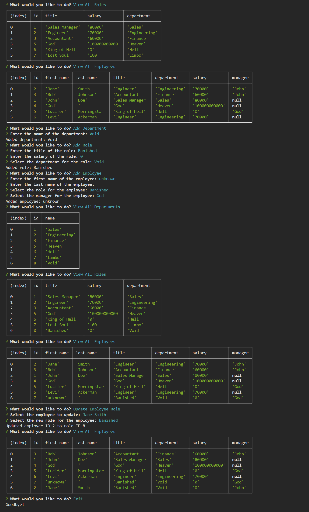

# Employee Tracker

## Description
A command-line application to manage a company's employee database using Node.js, Inquirer, and PostgreSQL.

## Screenshot

## Walkthrough Video
[Link to walkthrough video](https://drive.google.com/file/d/1Wl7fBYMVQBgjOGSaFG5BV9h18fuU5bsc/view?usp=sharing)

## Installation
1. Clone the repository.
2. Run `npm install` to install dependencies.
3. Set up your PostgreSQL database using `schema.sql` and `seeds.sql`.
4. Run `node index.js` to start the application.

## Usage
Follow the prompts to view and manage departments, roles, and employees.

## Credits
Developed by Endured.
